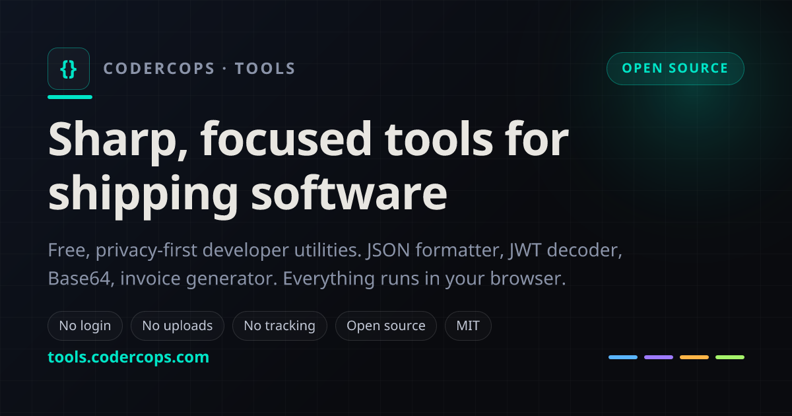
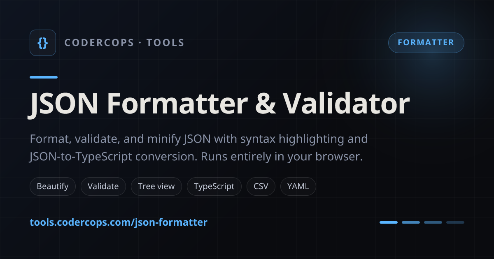
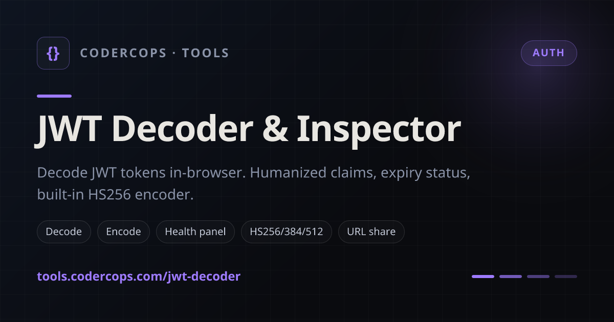
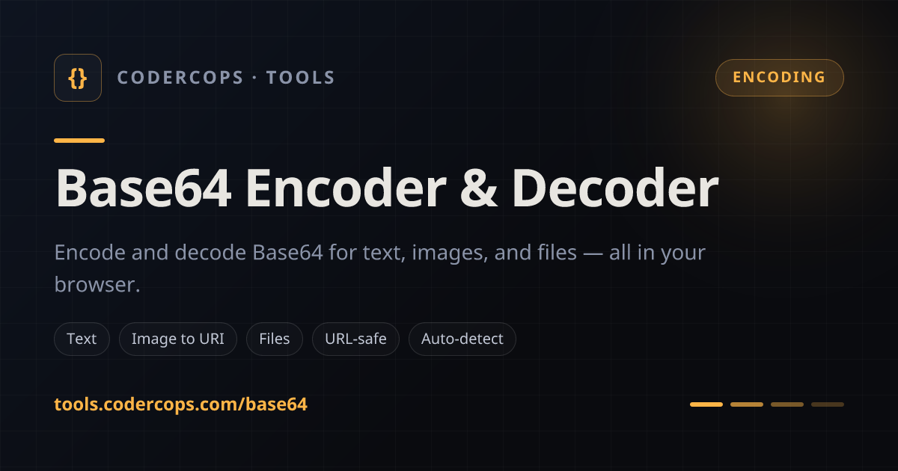
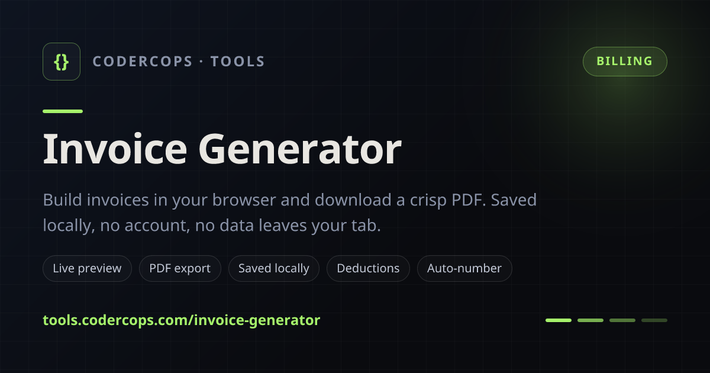

# toolbelt

[](https://tools.codercops.com)
[](./LICENSE)
[](https://github.com/codercops/toolbelt/actions/workflows/ci.yml)
[](https://github.com/codercops/toolbelt/stargazers)
[](https://github.com/codercops/toolbelt/commits)
[](https://www.codercops.com)

A developer's toolbelt: fast, privacy-first browser tools. Everything runs client-side, so there is no login, no upload, and no data leaves your tab. Live at **[tools.codercops.com](https://tools.codercops.com)**.

<p align="center">
  <a href="https://tools.codercops.com">
    
  </a>
</p>

<p align="center">
  <a href="https://tools.codercops.com"><b>Open the tools</b></a>
  &nbsp;·&nbsp;
  <a href="https://github.com/codercops/toolbelt/stargazers"><b>Star the repo</b></a>
  &nbsp;·&nbsp;
  <a href="./CONTRIBUTING.md"><b>Contribute</b></a>
</p>

## Contents

- [Tools](#tools)
- [Why it exists](#why-it-exists)
- [Stack](#stack)
- [Run locally](#run-locally)
- [Deploy your own](#deploy-your-own)
- [Add a tool](#add-a-tool)
- [Project layout](#project-layout)
- [Branching and releases](#branching-and-releases)
- [Contributing](#contributing)
- [Security](#security)
- [License](#license)

## Tools

<table>
  <tr>
    <td width="50%">
      <a href="https://tools.codercops.com/json-formatter"></a>
    </td>
    <td width="50%">
      <a href="https://tools.codercops.com/jwt-decoder"></a>
    </td>
  </tr>
  <tr>
    <td width="50%">
      <a href="https://tools.codercops.com/base64"></a>
    </td>
    <td width="50%">
      <a href="https://tools.codercops.com/invoice-generator"></a>
    </td>
  </tr>
</table>

- **[JSON formatter and validator](https://tools.codercops.com/json-formatter).** Format, minify, validate, collapsible tree view, and JSON to CSV / TypeScript / YAML / XML / query string. Large numbers are preserved losslessly.
- **[JWT decoder and inspector](https://tools.codercops.com/jwt-decoder).** Decode header, payload, and claims; verify HS/RS/PS/ES signatures via WebCrypto; security audit; HS256/384/512 encoder.
- **[Base64 encoder and decoder](https://tools.codercops.com/base64).** Text, images, and files; URL-safe variant; data URIs; magic-byte detection; Base32/58/85 and hashes.
- **[Invoice generator](https://tools.codercops.com/invoice-generator).** Live preview, vector PDF export with Unicode currency support, a reusable sender profile, all saved locally.

## Why it exists

CODERCOPS builds production backends and full-stack apps. These are the small utilities we reach for daily, rebuilt so they are genuinely private (nothing is sent anywhere) and pleasant to use. It is open source so you can read exactly what runs, self-host it, or borrow pieces.

## Stack

- Next.js 14 (App Router) and TypeScript
- Tailwind CSS with a small CSS-variable design system (light and dark themes)
- WebCrypto for JWT signing and verification
- jsPDF (dynamically imported) for invoice PDFs
- `lossless-json` so JSON number precision is never dropped
- Per-page Open Graph images and schema.org structured data, generated from the tool registry
- Installable PWA via a web manifest, with a nonce-based Content-Security-Policy

## Run locally

```bash
nvm use            # Node 22 (see .nvmrc)
npm install
npm run dev        # http://localhost:3000
```

Scripts:

```bash
npm run build      # production build
npm run start      # serve the production build
npm run lint       # eslint
npm run test       # vitest unit tests (lib/)
```

## Deploy your own

The app deploys to any Node host. On Vercel, import the repo and it builds with zero config. There are no required environment variables. If you fork it, update the domain in `lib/tools.ts` (`SITE_URL`) and `app/robots.ts` so the sitemap and canonical URLs point at your host, and update `GITHUB_REPO` in `lib/tools.ts` so the star-count link points at your fork.

## Add a tool

The tool set is a single typed registry in [`lib/tools.ts`](lib/tools.ts). The home grid, per-tool metadata, JSON-LD (SoftwareApplication, breadcrumb, FAQ), social share images, hero, FAQ, CTA, sitemap, web manifest, and command palette all derive from it. To add a tool:

1. Add an entry to the `TOOLS` array in `lib/tools.ts`.
2. Create `app/(tools)/<slug>/page.tsx` (metadata plus your client component), its `<Name>Client.tsx`, and an `opengraph-image.tsx` (a few lines that pass the registry entry to the shared renderer).
3. Put pure logic in `lib/` and cover it with a test in `lib/__tests__/`.

## Project layout

```
app/                 shell (layout, error/not-found boundaries, metadata routes)
app/(tools)/         one route per tool, sharing a layout and ToolPageLayout
components/shared/   header, theme, toasts, command palette, reusable UI
lib/                 pure per-tool logic (parsing, crypto, PDF, conversions), unit-tested
lib/tools.ts         the tool registry (single source of truth)
lib/jsonLd.ts        schema.org builders derived from the registry
lib/og.tsx           the shared Open Graph card renderer
public/fonts/        subset Noto Sans used by the invoice PDF and OG cards (OFL, see OFL.txt)
middleware.ts        per-request CSP nonce
```

## Branching and releases

- `develop` is the default and integration branch; `production` deploys to tools.codercops.com. The `develop` branch deploys to a staging domain, and every PR gets a Vercel preview.
- Work on `feat/*` / `fix/*` / `chore/*` / `docs/*` off `develop`, PR into `develop` and squash-merge.
- Release by merging a `develop` → `production` PR as a merge commit. That tags `vX.Y.Z`, publishes a GitHub Release, smoke-tests production, and fast-forwards `develop`.

See [CONTRIBUTING.md](./CONTRIBUTING.md) for the full flow.

## Contributing

Contributions are welcome. See [CONTRIBUTING.md](./CONTRIBUTING.md) and the [Code of Conduct](./CODE_OF_CONDUCT.md). In short: keep logic in `lib/`, add a test, and make sure `npm run lint && npm run test && npm run build` passes. If a tool proves useful, a star helps other developers find it.

## Security

Found a vulnerability? Please report it privately per [SECURITY.md](./SECURITY.md) rather than opening a public issue.

## License

MIT, see [LICENSE](./LICENSE). The bundled Noto Sans font subsets are under the SIL Open Font License 1.1 ([public/fonts/OFL.txt](public/fonts/OFL.txt)).

The tool social cards in [`.github/assets/`](.github/assets) are generated from [`lib/og.tsx`](lib/og.tsx); regenerate them if a tool's name or copy changes.
